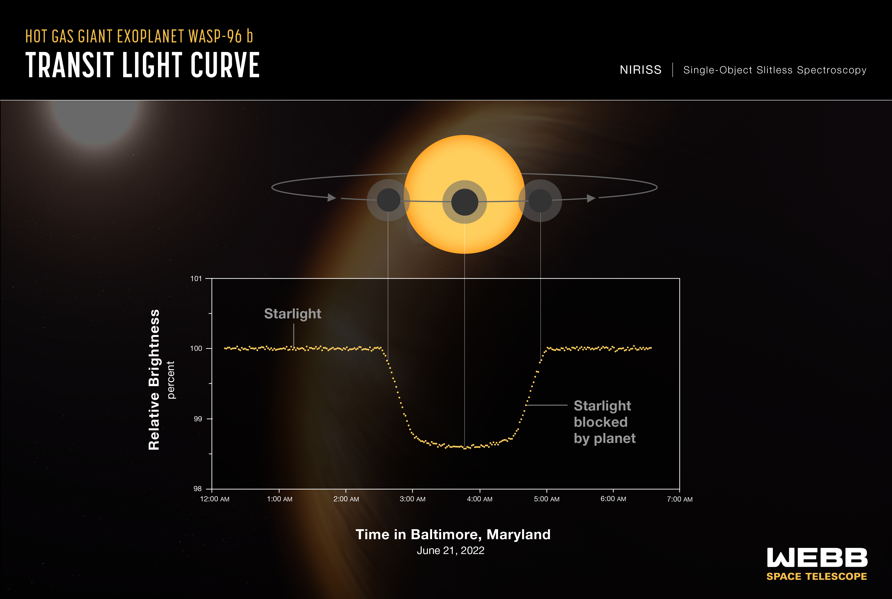

Detecting exoplanets using the transit method became extremely popular with NASA's Kepler mission, and has stayed popular with missions like the Transiting Exoplanet Systems Satellite (TESS) have been providing lots of data on distant star's light intensity (also known as flux) fluctuations. The transit method of exoplanet detection involves observing the flux coming from a distant star and checking for any fluctuations including dips or dimming. If an object passes between the observer and the star, the flux seen by the observer will dip. So, if an exoplanet that orbits a star passes in front of the star, we will see the flux coming from that star drop. A visualization of this can be seen below.

As of today, 3,986 exoplanets have been detected with this method.

The James Webb Space Telescope (JWST) has also utilized the transit method, as seen above, and the upcoming Nancy Grace Roman Telescope will utilize the transit method as well to find exoplanets. With the amount of data that is coming in and may be coming in the future, it could be extremely useful to automate the process of searching flux data for these characteristic fluctuations that lead to exoplanet detections.

In this notebook, I will build an Artifical Neural Network (ANN) to hopefully classify stellar flux time series data into two classes: exoplanet detected from transit (2) or no exoplanet detected (1). 

Training and testing data is obtained from the Kepler mission, specifically downloaded from [this Kaggle dataset](https://www.kaggle.com/datasets/keplersmachines/kepler-labelled-time-series-data?select=exoTest.csv). Data is already cleaned and preprocessed and split into training and testing segments. There are 5 confirmed exoplanet host stars and 565 normal stars in testing data and 37 confirmed exoplanet host stars and 5050 normal stars in training data.

Overall, it was found that the model could not accurately predict patterns and was overfitting even on the simplest of ANN architectures. Without more data to train and test one, the model could not obtain loss metrics lower than 1.0.